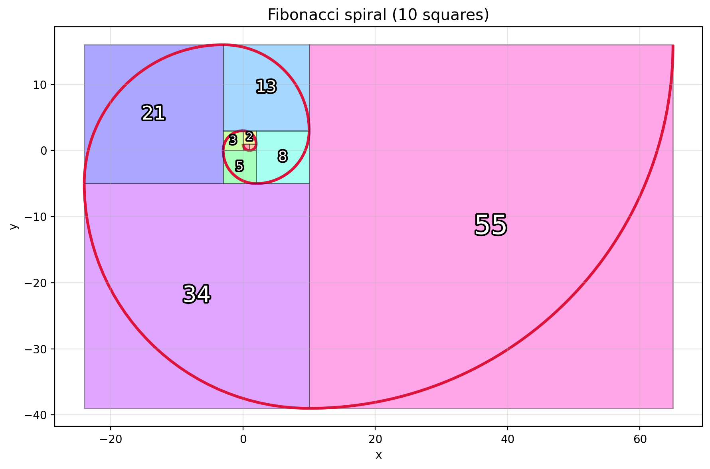

# fibonacci-spiral

A small Python script that draws the Fibonacci spiral with matplotlib. It tiles squares whose side lengths follow the Fibonacci sequence and draws a quarter-circle arc in each one, so the arcs join into a continuous spiral.



## Requirements

- Python 3.9 or newer
- matplotlib 3.5 or newer

## Installation

```bash
git clone https://github.com/dorrill/fibonacci-spiral.git
cd fibonacci-spiral
python3 -m venv .venv
source .venv/bin/activate        # On Windows: .venv\Scripts\activate
pip install -r requirements.txt
```

## Usage

Open an interactive window with the default 10 squares:

```bash
python3 fibonacci_spiral.py
```

Some other examples:

```bash
python3 fibonacci_spiral.py -n 14                    # more squares
python3 fibonacci_spiral.py --cmap viridis --axes    # different colors, with x-y axes
python3 fibonacci_spiral.py --no-labels --arc-color '#1f77b4'
python3 fibonacci_spiral.py -n 12 --save images/spiral_example.png
```

### Options

| Option | Default | Description |
| --- | --- | --- |
| `-n`, `--squares` | `10` | Number of squares to draw (must be at least 1) |
| `--cmap` | `gist_rainbow` | Any [matplotlib colormap](https://matplotlib.org/stable/gallery/color/colormap_reference.html) for the squares |
| `--arc-color` | `crimson` | Color of the spiral line, as a name or hex code |
| `--arc-width` | `2.5` | Line width of the spiral |
| `--axes` / `--no-axes` | off | Show x-y axes and a grid |
| `--labels` / `--no-labels` | on | Label each square with its side length |
| `--save FILE` | none | Save to a file (`.png`, `.pdf`, `.svg`, ...) instead of opening a window |

Run `python3 fibonacci_spiral.py --help` for the full list.

### Using it from Python

The plotting function can be imported, for example into a Jupyter notebook. `plot_spiral` returns a matplotlib `Figure`, so you can show it, save it, or keep editing it:

```python
from fibonacci_spiral import SpiralOptions, plot_spiral

fig = plot_spiral(SpiralOptions(n=12, cmap="plasma", show_axes=True))
fig.savefig("my_spiral.png", dpi=200)
```

## How it works

The Fibonacci sequence starts 1, 1, and each later number is the sum of the two before it: 1, 1, 2, 3, 5, 8, 13, ...

1. Each new square is attached to the right, top, left, then bottom of the bounding box of all the previous squares. This cycle repeats.
2. Inside each square, a quarter-circle arc is drawn with a radius equal to the square's side. Its center is the corner of the square facing the spiral's interior.
3. Each arc starts exactly where the previous one ends, so together they form one smooth counterclockwise curve.

The ratio of consecutive Fibonacci numbers approaches the golden ratio φ ≈ 1.618. As the number of squares grows, the curve gets closer to a true golden spiral, the logarithmic spiral r = a·φ^(2θ/π), which grows by a factor of φ every quarter turn.

## License

This project is licensed under the MIT License. See [LICENSE](LICENSE) for details.
